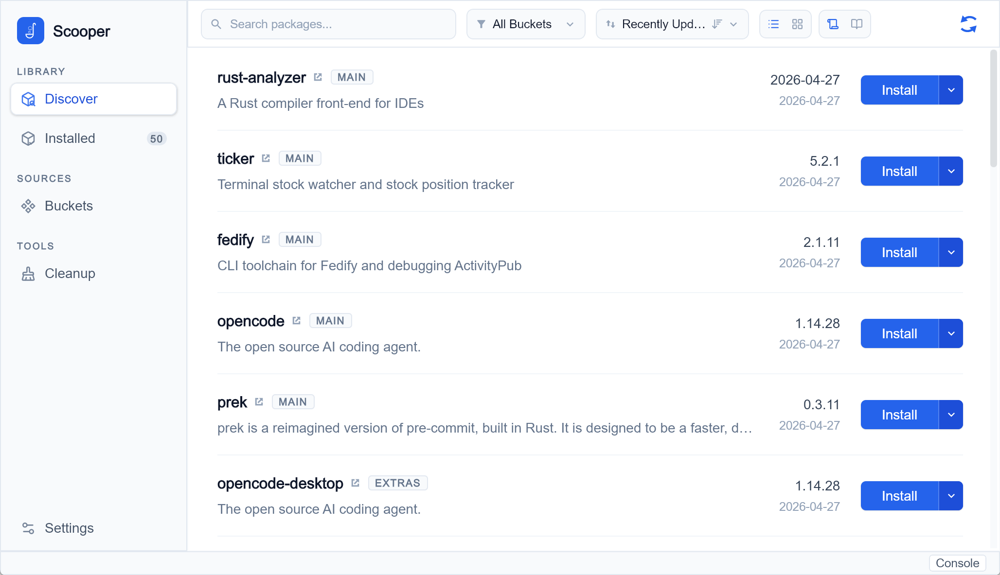

# Scooper

**A Modern GUI for Scoop.**

[Scoop](https://scoop.sh/) is a powerful command-line package manager for Windows, but daily usage through the CLI can be tedious. Scooper provides a modern, intuitive graphical interface to manage your Scoop apps with ease.

## Features

- **App Management**: Browse, install, update, and uninstall apps with one click
- **Grid & List Views**: Switch between compact grid and detailed list layouts
- **Version History**: Browse previous versions and install any specific version
- **Quick Launch**: Open installed apps directly via shortcut detection
- **Keyboard Shortcuts**: Full keyboard navigation (Ctrl+F, Ctrl+R, Ctrl+1–4, and more)
- **Dark Mode**: Native light and dark theme support
- **Font Scaling**: Adjustable font size (0.8×–1.5×) for comfortable reading
- **Bucket Management**: Add, browse, and remove Scoop buckets

## Installation

Install with Scoop:

```cmd
scoop bucket add extra
scoop install scooper
```

## Requirements

- Windows 10/11
- [Scoop](https://scoop.sh/) installed

## License

[MIT](./LICENSE)
