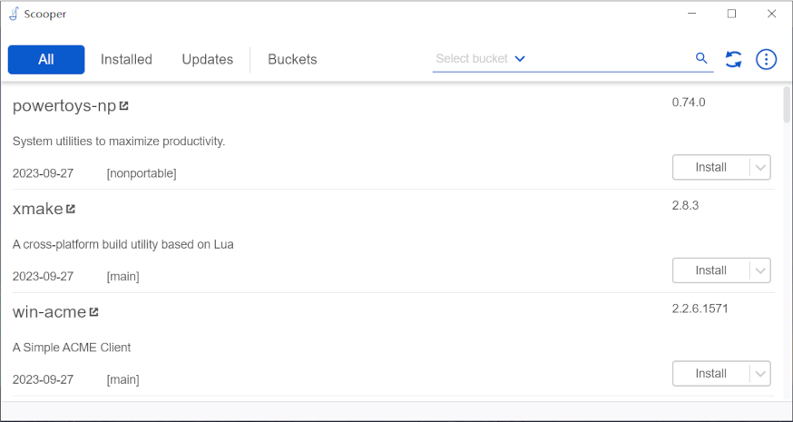

# Scooper
The Missing GUI of Scoop.

[Scoop](https://scoop.sh/) is a powerful tool to manage apps under windows, but for daily usage, the command line interface is a little painful, this ultility can make life easier to maintain(install/upgrade/navigate/remove) apps.

# Screenshot

# How to use

Just download the install package in the release page.

# License
MIT
